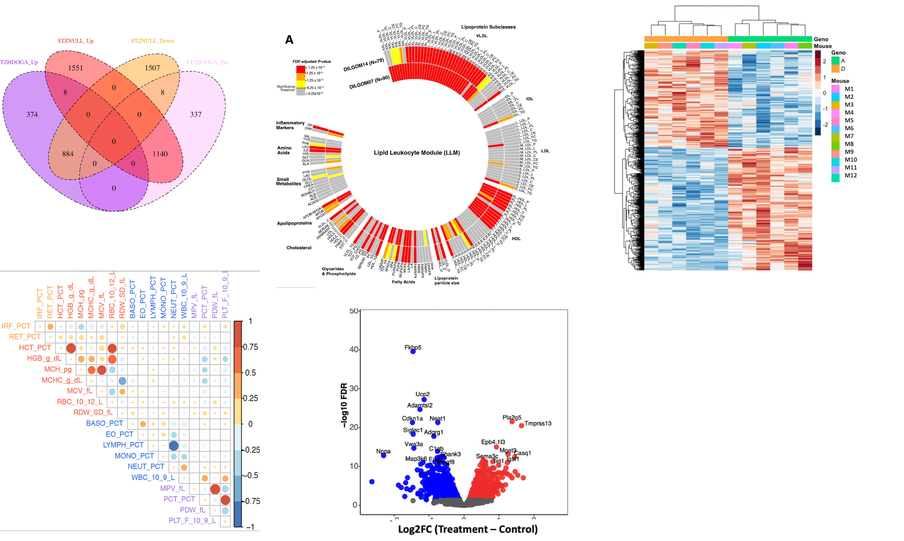

# Introduction

```{r echo=TRUE}
#install.packages('ggplot2')
library(ggplot2)
library(wesanderson)
library(cowplot)
```

GGPlot2 is an R package for producing elegant statistical, or data, graphics piece by piece.

::: remember
The gg means Grammar of Graphics, a graphic concept which describes plots by using a “grammar”
:::

According to the ggplot2 concept, a plot can be divided into three different fundamental parts: 

* Data: Information that you want to visualise
* Aesthetics: Indicate variables to be used, color, size, shape, ...
* Geometry: Indicate the type of graphics (points, box plots, bar plot, ...)

GGPlot2 is designed to work in layers. In brief, the ggplot2 tells us that a graphic maps the **data** to the **aesthetic** (aes) attributes (colour, shape, size) of **geometric** objects (points, lines, bars). Note that, you can keep enhancing the plot by adding more layers (and themes) to an existing plot created using the ggplot() function.

For a more in-depth description of the ggplot2 packages, the following links are useful:

* [The ggplot2 book](https://ggplot2-book.org/)
* [The R-graph gallery](https://www.r-graph-gallery.com/)
* [GGPlot Cheat Sheet for Great Customization](http://www.sthda.com/english/articles/32-r-graphics-essentials/125-ggplot-cheat-sheet-for-great-customization/)
* [The ggplot2: Cheat Sheet](https://raw.githubusercontent.com/rstudio/cheatsheets/main/data-visualization.pdf)
* [RStudio Cheatsheets](https://raw.githubusercontent.com/rstudio/cheatsheets/main/data-visualization.pdf)


```{r basic_p, child='./basic_plots.Rmd'}
```


```{r color_p, child='./color_aes.Rmd'}
```


```{r themes_p, child='./themes_plot.Rmd'}
```


```{r facet_p, child='./facet_plots.Rmd'}
```


```{r multi_p, child='./multiplot.Rmd'}
```


# Other Plots




```{r tree_p, child='./tree_plot.Rmd'}
```


