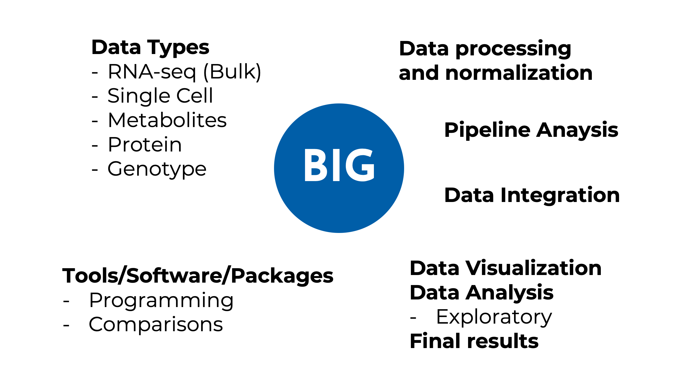

class: left, middle

```{r xaringan-logo, echo=FALSE}
xaringanExtra::use_logo(
  image_url = "baker-bioinfo.jpg",
  width = "140px",
  position = xaringanExtra::css_position(bottom = "-2em", left="1.8em")
)
```

```{r xaringan-themer, include=FALSE, warning=FALSE}
library(xaringanthemer)
library(tidyverse)
style_mono_accent(
  base_color = "#1c5253",
  header_font_google = google_font("Josefin Sans"),
  text_font_google   = google_font("Montserrat", "300", "300i"),
  code_font_google   = google_font("Fira Mono")
)
# style_mono_light(base_color = "#23395b")
style_duo_accent(primary_color = "#005EA7", secondary_color = "#D31245",
                 header_font_google = google_font("Josefin Sans"),
                 text_font_google   = google_font("Montserrat", "500", "500i"),
                 code_font_google   = google_font("Fira Mono"))
### live update of slides
# xaringan::inf_mr( )
```


# Special Interest Group

--

### a community within a larger organization with a shared interest in advancing a specific area of knowledge

---
class: left, middle

# **Bioinformatics** Interest Group

### a community within a larger organization with a shared interest in advancing **bioinformatics** knowledge

---
class: left, middle

.pull-left[
.right[
### Be present

### **Ask questions** 

### Everyone is welcome
]]

--

.pull-right[
### **ECRs encouraged**

### Feel free to interrupt

### **Share and participate**
]

---
class: left

# **Bioinformatics** Interest Group

BIG meetings will be a **regular**, **flexible** and **highly interactive** forum for anyone around Baker who is using or interested in bioinformatics for their research. 

--

Its goals are:

--
- Better link bioinformatics researchers around Baker
  - those in labs whose focus is bioinformatics
  - those who are the lone bioinformatican in the lab


--

- Build capacity through increased communications (e.g. a dedicated slack?) and sharing of expertise/code (e.g. via a github repo)


--

- Share and solve any problems or issues that might be common to other colleagues
---



---
class: center, middle, inverse

# Session 1: UK Biobank

## `r emo::ji("link")` <a href="https://www.ukbiobank.ac.uk/" style="color: white; text-decoration: underline;">ukbiobank.ac.uk</a>

---
class: middle

# UK Biobank

- BITS presentation in September 2021 [here](https://intranet.baker.edu.au/staff-room/institute-seminars/information-and-technology-seminars/)

  - Introduction about the team
  - **Main summary of UK Biobank**


<iframe frameborder=0 src="https://docs.google.com/presentation/d/e/2PACX-1vTmKtnvN19Jt42S2kL4fo773nQKOeqrqMsQ7On_Mcoa3786tZ5OYBRM2TOnDAedH9Sm8x8tNyYkT-Cv/embed?start=false&loop=false&delayms=60000&slide=5" style="position:absolute; top:30%; left:45%; width:500px; height:317px;"></iframe>

---
# UK Biobank
Navigate UK Biobank publicly available data (https://biobank.ctsu.ox.ac.uk/crystal/)

<iframe frameborder=0 src="https://biobank.ctsu.ox.ac.uk/crystal" style="position:absolute; top:30%; left:15%; width:800px; height:370px;"></iframe>


---

# UK Biobank
#### How many male/female are there? &#8594; https://biobank.ctsu.ox.ac.uk/crystal/field.cgi?id=31

<iframe frameborder=0 src="https://biobank.ctsu.ox.ac.uk/crystal/field.cgi?id=31" style="position:absolute; top:30%; left:15%; width:800px; height:370px;"></iframe>

--

<br><br><br>

**54% of <br> UKB sex <br> is female**

---
class: center

<br><br>

# Things can get ~~complex~~ interesting

--

<br>

#### How many of those females have had babies?

#### What's the average age of T1D diagnoses?

#### How many males have been diagnosed with T2D?

#### How many medications are people with HF taking?

#### ...


---
class: inverse, middle, center

# Test case 1

## Diabetes in UKB

---
### Test case 1 (`r emo::ji("link")` [Diabetes in UKB](diab_bigmeeting.html))

<iframe frameborder=1 src="diab_bigmeeting.html" style="position:absolute; top:15%; left:5%; width:1080px; height:480px;"></iframe>

---
class: inverse, middle, center

# Test case 2

## Heart Failure and medication

---
### Test case 2 (`r emo::ji("link")` [HF and medication](BIGS_ExampleByArtika_HFMedicationUse.html))

<iframe frameborder=1 src="BIGS_ExampleByArtika_HFMedicationUse.html" style="position:absolute; top:15%; left:5%; width:1080px; height:480px;"></iframe>

---
class: inverse, middle, center

# Test case 3

## Atrial Fibrillation in UKB

---
### Test case 3 (`r emo::ji("link")` [Atrial Fibrillation](Example_Rcanovas_211116lifestyle.html))

<iframe frameborder=1 src="Example_Rcanovas_211116lifestyle.html" style="position:absolute; top:15%; left:5%; width:1080px; height:480px;"></iframe>

---
class: inverse, middle, center

# Extra Information

## UKB folder structure in the Baker cluster

---
### Extra - Baker cluster structure

<iframe frameborder=1 src="UKB_folder_structure.html" style="position:absolute; top:15%; left:5%; width:1080px; height:480px;"></iframe>

---
class: middle, center

## Help us out!

#### **We would like to hear your opinion**

Please, scan the QR code and answer an anonymous 1-min-survey to help us for future BIG Meetings


[**tiny.cc/jdjluz**](http://tiny.cc/jdjluz)

---
class: center, middle, inverse

# Thanks all for coming!

## See you next time <br> (TBD, mid-Dec)

All material and information  available in <br> [**.white[bakerbioinformatics.github.io/BIG-Meetings]**](https://bakerbioinformatics.github.io/BIG-Meetings/)

<br><br><br>

Slides created with the R package [**xaringan**](https://github.com/yihui/xaringan), <br> using [**remark.js**](https://remarkjs.com), [**knitr**](https://yihui.org/knitr/), and [**R Markdown**](https://rmarkdown.rstudio.com)
